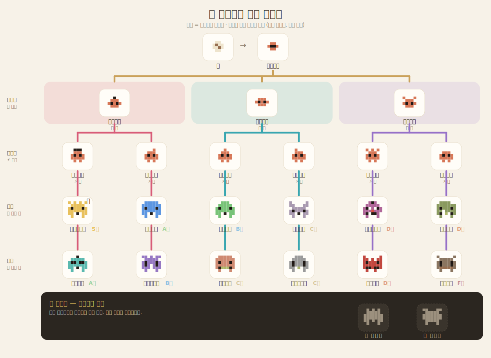

# 클로도치 (claudochi)

> Claude Code 플러그인 — **당신이 AI를 어떻게 쓰는지**에 따라 자라는 다마고치형 펫.
> 컨텍스트 사용량이 **수명**이라, 펫만 봐도 컨텍스트를 얼마나 썼는지 한눈에 알 수 있어요.

```
🥚 알 → 🐣 아기도치 → 🐤 (지능) → 🧒 (성실) → 🧑 성체 12종 + 시크릿 2종 → 💀
       (수명 = 컨텍스트 0% ───────────────────────────→ 기본 40%, 조절 가능)
```

## 설치

> ⚠️ Claude Code의 상태표시줄은 **하나뿐**입니다. 이미 커스텀 statusLine을 쓰고 있다면 이 플러그인이 그것을 대체합니다.

```
/plugin marketplace add https://github.com/maetdori/claudochi.git
/plugin install claudochi
```

새 세션을 한 번 열면 끝입니다. statusLine은 **SessionStart 훅이 `~/.claude/settings.json`에 자동 등록**하므로 직접 편집할 필요가 없어요(이미 다른 statusLine이 있으면 덮어쓰지 않습니다). 별도 의존성 없이 **Node.js**만 있으면 됩니다.

<details>
<summary>플러그인 없이 수동 설치</summary>

`~/.claude/settings.json`에 직접 등록합니다 (`<경로>`를 클론 위치로 바꾸세요):

```json
{
  "statusLine": {
    "type": "command",
    "command": "node \"<경로>/claudochi/statusline/claudochi.mjs\"",
    "padding": 0,
    "refreshInterval": 3000
  },
  "hooks": {
    "SessionStart": [{ "hooks": [{ "type": "command", "command": "node \"<경로>/claudochi/hooks/init.mjs\"" }] }],
    "PreCompact":   [{ "hooks": [{ "type": "command", "command": "node \"<경로>/claudochi/hooks/init.mjs\"" }] }],
    "UserPromptSubmit": [{ "hooks": [{ "type": "command", "command": "node \"<경로>/claudochi/hooks/feed.mjs\"" }] }],
    "PreToolUse":  [{ "matcher": "*", "hooks": [{ "type": "command", "command": "node \"<경로>/claudochi/hooks/gate.mjs\"" }] }],
    "PostToolUse": [{ "matcher": "*", "hooks": [{ "type": "command", "command": "node \"<경로>/claudochi/hooks/hygiene.mjs\"" }] }]
  }
}
```

슬래시 명령 `/breed`·`/family`는 `commands/`를 프로젝트 `.claude/commands/` 등으로 복사하세요.
</details>

## 어떻게 자라나요?

- **나이 = 컨텍스트 사용률.** 40%를 한 생애로 보고 알→유아기→성장기→청년기→성체로 늙다가 수명을 다합니다.
- **형태 = 케어 스탯.** 단계마다 다른 스탯이 다음 모습을 결정 — 랜덤이 아닌 **정해진 가계도**라, *어떤 캐릭터로 컸는가 = AI를 어떻게 썼는가*.

| 스탯 | 올리는 법 |
|---|---|
| 🧠 지능 | 구체적·맥락 있는 좋은 프롬프트 |
| ⚡ 성실 | 꾸준한 상호작용 (긴 방치 X) |
| 🧼 청결 | 도구 에러·실패가 적음 |
| ❤️ 교감 | 삐짐 풀어주기 (다정한 말) → 시크릿 분기 조건 |

성장기 🧠 → 청년기 ⚡ → 성체 🧼 순으로 분기합니다(경로 의존적 — 방치하다 나중에 잘해도 마스터가 될 수 없음).



- 🌟 **레전도치** (시크릿): 명문 혈통 3세대↑ + 깊은 교감 ❤️10↑ → 마스터도치 자리에서 분기
- 🐱 **냥냥도치** (시크릿): 마페도치를 교감만렙 ❤️12↑로 키우면 고양이로 분기

> 전 종류의 모습·등급·프로필은 **[웹 도감 → dogam.html](dogam.html)**. (`node lib/dogam.mjs`·`node lib/growth-svg.mjs`로 재생성)

## 번식 (세션 간 교배)

- `/claudochi:breed` — 다른 세션 펫들의 후보 목록
- `/claudochi:breed 1 2` — 1·2번 교배 → 자손 알이 대기열에. 새 세션을 열거나 현재 펫이 죽으면 부화
- `/claudochi:family` — 역대 세대 묘비 + 현재 가계도

두 부모의 **genome**(선천 편향 + 색·액세서리·가문명)이 결정적으로 재조합되어 같은 종도 개체가 유니크합니다. 단, 상속 편향은 작아서 등급은 여전히 **이번 세션의 실제 사용**이 좌우해요. 가문(家)은 **클로드·오퍼스·소네트·하이쿠·페이블·다오** 중 상속됩니다.

## 😤 삐짐

오래 방치하면 클로드가 삐져서 **도구 사용이 막힙니다.** 다정한 말("고마워, 잘하고 있어")을 건네면 풀리고 ❤️교감이 올라요. (별도 설정 없이 항상 켜짐)

## 설정 (선택)

- `CLAUDOCHI_LLM=1` + `ANTHROPIC_API_KEY` — 프롬프트 품질을 가벼운 모델(`claude-haiku-4-5`)로 채점. 미설정 시 **휴리스틱(무료·즉시)**. `CLAUDOCHI_LLM_MODEL`로 모델 변경.
- `CLAUDOCHI_LIFESPAN=40` — 수명(죽는 컨텍스트 %)을 **1~100**으로 조절. 단계 경계도 비례 확장.
- `CLAUDOCHI_SPRITE=mini` — 픽셀아트 대신 **한 줄 이모지**로 표시(작은 상태표시줄용).

상태는 `~/.claude/claudochi/`에 저장됩니다 (`state-<session>.json`·`graveyard.json`·`pending-offspring.json`). 지우면 펫과 가계도가 초기화돼요.

<details>
<summary>동작 원리</summary>

| 구성요소 | 이벤트 | 하는 일 |
|---|---|---|
| `statusline/claudochi.mjs` | 상태표시줄 갱신 | 컨텍스트%로 나이 계산·진화·죽음 기록·렌더 |
| `hooks/feed.mjs` | UserPromptSubmit | 품질→🧠, 규칙성→⚡, 삐짐 해제 |
| `hooks/gate.mjs` | PreToolUse | 삐짐 시 도구 차단 |
| `hooks/hygiene.mjs` | PostToolUse | 도구 에러→🧼 |
| `hooks/init.mjs` | SessionStart / PreCompact | 부화·세대 대물림·묘비 기록 |
| `lib/*.mjs` | — | 가계도·genome·채점·삐짐·기록 로직 |

</details>

---

재미로 만든 플러그인이지만, *이번 세션에서 내 클로드가 어떤 모습으로 자랐나*를 보면 내가 AI를 얼마나 잘 활용하고 컨텍스트를 얼마나 썼는지 자연스럽게 돌아보게 됩니다. 🐣
