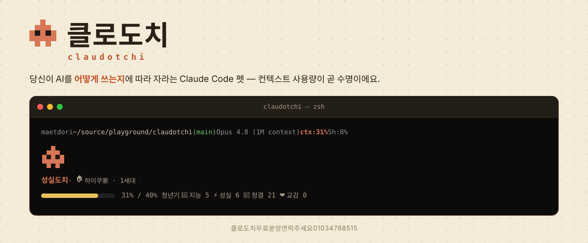

<div align="center">



**Claude Code 플러그인 — 컨텍스트 사용량이 곧 수명인 다마고치형 펫.**
당신이 AI를 **어떻게 쓰는지**에 따라 자라서, 펫만 봐도 이번 세션에서 컨텍스트를 얼마나 썼는지 한눈에 보여줘요.

</div>

## 설치

> ⚠️ Claude Code의 상태표시줄은 **하나뿐**입니다. 이미 커스텀 statusLine을 쓰고 있다면 이 플러그인이 그것을 대체합니다.

```
/plugin marketplace add https://github.com/maetdori/claudotchi.git
/plugin install claudotchi
```

새 세션을 한 번 열면 끝입니다. statusLine은 **SessionStart 훅이 `~/.claude/settings.json`에 자동 등록**하므로 직접 편집할 필요가 없어요(이미 다른 statusLine이 있으면 덮어쓰지 않습니다). 별도 의존성 없이 **Node.js**만 있으면 됩니다.

설정을 고르고 싶다면 **`/claudotchi:setup`** — 수명·렌더·LLM 채점·삐짐을 질의로 한 번에 선택합니다. 나중에 아무 때나 **`/claudotchi:config`** 로 바꿀 수 있어요(파일 편집·재시작 불필요, 모든 세션 공유).

<details>
<summary>플러그인 없이 수동 설치</summary>

`~/.claude/settings.json`에 직접 등록합니다 (`<경로>`를 클론 위치로 바꾸세요):

```json
{
  "statusLine": {
    "type": "command",
    "command": "node \"<경로>/claudotchi/statusline/claudotchi.mjs\"",
    "padding": 0,
    "refreshInterval": 3000
  },
  "hooks": {
    "SessionStart": [{ "hooks": [{ "type": "command", "command": "node \"<경로>/claudotchi/hooks/init.mjs\"" }] }],
    "PreCompact":   [{ "hooks": [{ "type": "command", "command": "node \"<경로>/claudotchi/hooks/init.mjs\"" }] }],
    "UserPromptSubmit": [{ "hooks": [{ "type": "command", "command": "node \"<경로>/claudotchi/hooks/feed.mjs\"" }] }],
    "PreToolUse":  [{ "matcher": "*", "hooks": [{ "type": "command", "command": "node \"<경로>/claudotchi/hooks/gate.mjs\"" }] }],
    "PostToolUse": [{ "matcher": "*", "hooks": [{ "type": "command", "command": "node \"<경로>/claudotchi/hooks/hygiene.mjs\"" }] }]
  }
}
```

슬래시 명령(`/setup`·`/config`·`/statusline`·`/breed`·`/family`·`/sulk`)은 `commands/`를 프로젝트 `.claude/commands/` 등으로 복사하세요.
</details>

## 무엇이 특별한가

- 🌱 **케어로 갈라지는 성장** — 알에서 성체까지, 스탯(🧠 지능·⚡ 성실·🧼 청결·❤️ 교감)이 **정해진 가계도**를 따라 분기합니다. 성체 12종 + 시크릿 3종 — *어떤 캐릭터로 컸는가 = AI를 어떻게 썼는가.*
- 🧬 **세션 간 번식** — 다른 세션의 펫과 교배해 다음 세대 알을 남겨요 (`/claudotchi:breed`·`/claudotchi:family`).
- 😤 **삐짐** — 오래 방치하면 클로드가 삐져 도구 사용이 막히고, 다정한 말을 건네면 풀리며 ❤️ 교감이 올라요.

> 성장 가계도·도감·컬렉션·번식·삐짐·설정을 한 페이지에서 — **[클로도치 웹페이지 ↗](https://maetdori.github.io/claudotchi/)**
> 로컬에선 `node lib/app.mjs`로 `index.html`을 재생성해 브라우저로 열어요.

---

재미로 만든 플러그인이지만, *이번 세션에서 내 클로드가 어떤 모습으로 자랐나*를 보면 내가 AI를 얼마나 잘 활용하고 컨텍스트를 얼마나 썼는지 자연스럽게 돌아보게 됩니다. 🐣
